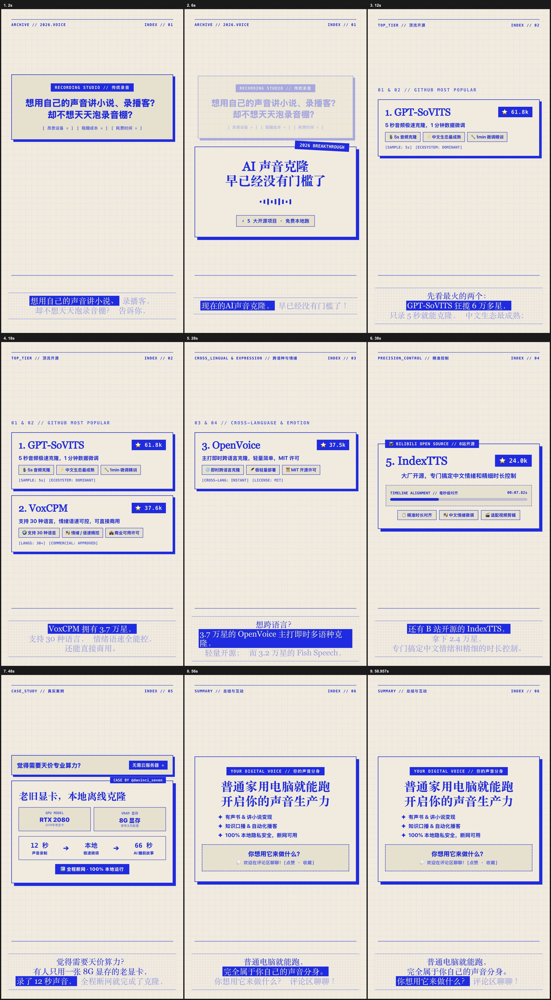

# autoChatCut: 声音克隆与知识短视频自动化制作工程

> **《克隆自己的声音，现在已经没什么门槛了》** —— 60 秒知识类短视频全自动化制作流水线与工程源码。

本项目基于 **HyperFrames (faceless-explainer 工作流)**，使用 `edge-tts`（音色：`zh-CN-YunyangNeural`）驱动音频定稿，结合精确的音频时间戳与 **Cobalt Grid** 极客技术风设计系统，自动化生成全套分镜、动效排版、卡拉OK字幕与高画质短视频成片。

---

## 📺 Demo 视频与分镜预览

- **完整成片视频 (60.8s MP4)**: [`videos/voice-clone-explainer/renders/video.mp4`](videos/voice-clone-explainer/renders/video.mp4)
- **前 15 秒风格确认预览切片 (15.0s MP4)**: [`videos/voice-clone-explainer/renders/preview-15s.mp4`](videos/voice-clone-explainer/renders/preview-15s.mp4)
- **画幅规格**: `1080 × 1920`（9:16 竖屏，适配抖音、小红书、视频号、Reels）

### 全部分镜联系表 (Contact Sheet)


---

## 📚 目录结构

```text
autoChatCut/
├── README.md                              # 项目说明
├── .gitignore
├── docs/
│   ├── macos-setup-guide.md               # macOS 搭建与部署指南（含 Apple Silicon M系列芯片与 MPS 加速）
│   └── windows-setup-guide.md             # Windows 搭建与部署指南（含 GPT-SoVITS 8G 显卡实操）
└── videos/
    └── voice-clone-explainer/             # 视频工程源码
        ├── BRIEF.md                       # 视频创作需求与设计规范
        ├── SCRIPT.md                      # 定稿口播脚本（268字，3s钩子）
        ├── STORYBOARD.md                  # 6 大分镜时间轴与镜头设计
        ├── audio_meta.json                # 音频元数据与毫秒级字幕时间戳
        ├── index.html                     # HyperFrames 主编排文件
        ├── frame.md                       # Cobalt Grid 视觉系统规范
        ├── compositions/                  # 分镜动效组件
        │   ├── captions.html              # 动态卡拉OK字幕条
        │   └── frames/                    # 6 个分镜 HTML 模板
        ├── assets/voice/                  # edge-tts 合成的高保真原声 WAV
        ├── snapshots/                     # 关键帧抽样截图与 Contact Sheet
        └── renders/                       # 渲染输出的 MP4 视频成片
            ├── video.mp4                  # 60 秒完整成片
            └── preview-15s.mp4            # 前 15 秒预览切片
```

---

## 🛠️ 快速上手与运行

### 1. 环境准备
- **Node.js** >= 20.0
- **FFmpeg**（已配置进环境变量 PATH）
- **Python 3.10+** 并安装 `edge-tts`：
  ```bash
  pip install edge-tts
  ```
- **全局安装 HyperFrames CLI**：
  ```bash
  npm install -g hyperframes
  ```

### 2. 检查与渲染视频
进入工程目录：
```bash
cd videos/voice-clone-explainer

# 检查时间轴与动效健康度
hyperframes check

# 启动本地浏览器实时预览
hyperframes preview

# 渲染导出完整 MP4 成片
hyperframes render . --output renders/video.mp4
```

---

## 📖 相关文档
- [macOS 搭建与 Apple Silicon MPS 声音克隆指南](docs/macos-setup-guide.md)
- [Windows 搭建与本地 8G 显卡声音克隆指南](docs/windows-setup-guide.md)
